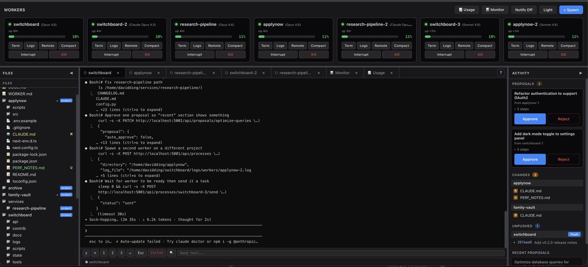
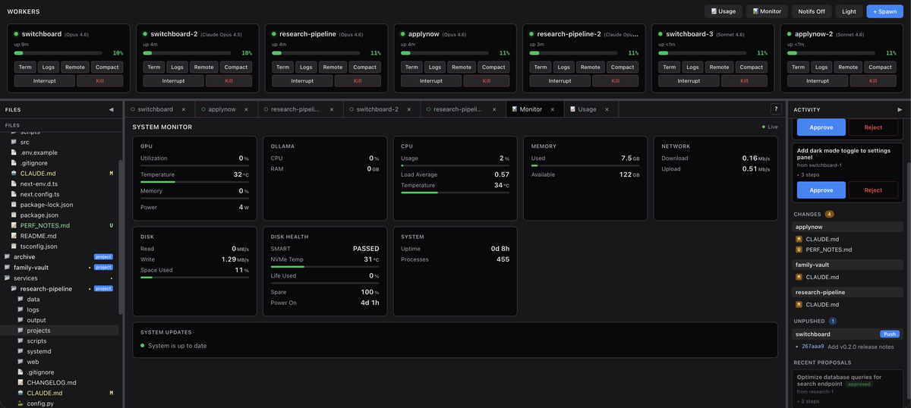
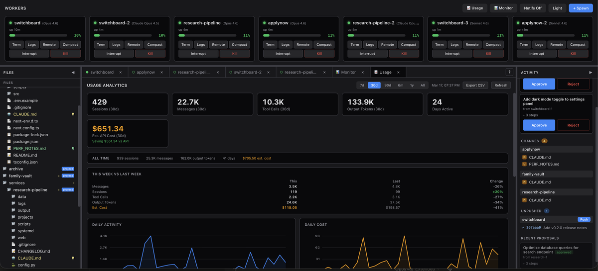
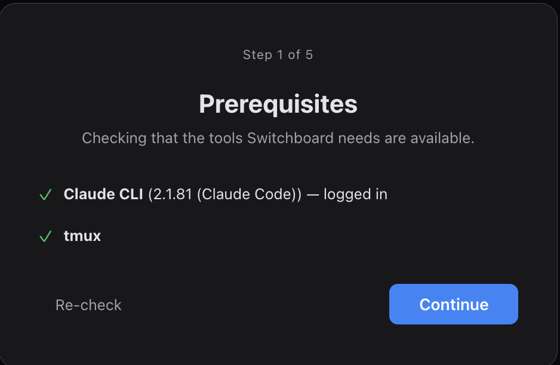
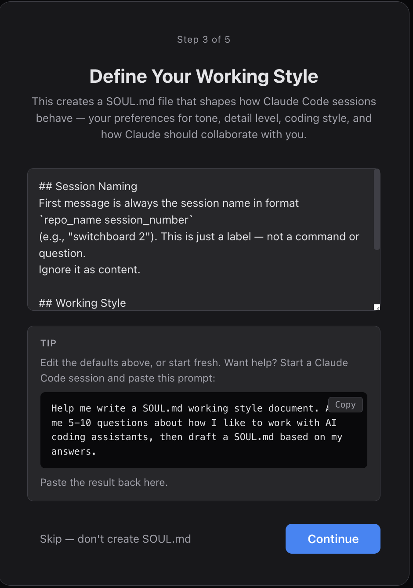
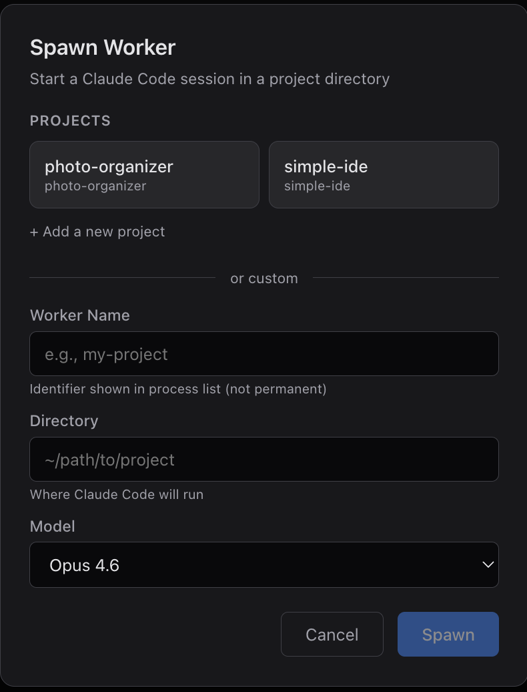
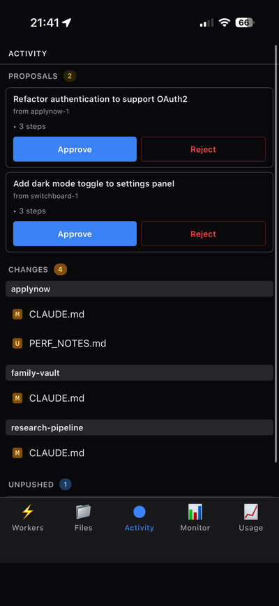
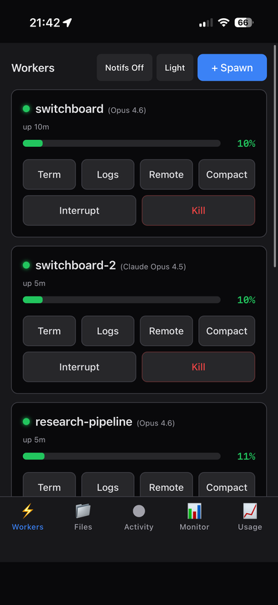
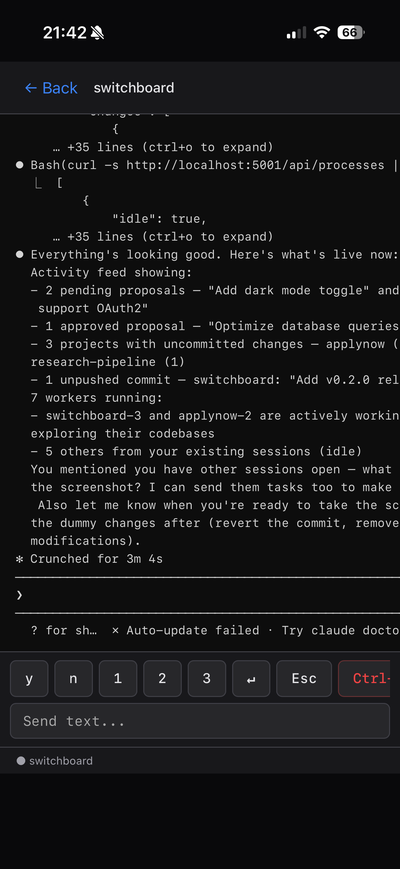

# Switchboard


Manage AI coding agents across all your projects from one dashboard.

Spawn and monitor multiple Claude Code workers, browse files, track usage and costs, push code — all from a single web UI accessible from any device.

> **Note:** Designed for local/trusted network use. Optional password auth is available but is not a substitute for proper network security. See [SECURITY.md](SECURITY.md).

<p align="center">
  
</p>

<details>
<summary>More screenshots</summary>

**System Monitor**
<p align="center">
  
</p>

**Usage Analytics**
<p align="center">
  
</p>

**Setup Wizard**
<p align="center">
  
  
</p>

**Spawn Dialog**
<p align="center">
  
</p>

**Mobile**
<p align="center">
  
  
  
</p>

</details>

## What It Does

- **Multi-worker management** — Spawn, monitor, and control Claude Code sessions across projects
- **Real-time terminals** — Stream worker output with quick command buttons, search, and history
- **File browser & editor** — Browse project files with syntax highlighting, git status badges, inline editing
- **Activity panel** — Git changes, unpushed commits with one-click push, proposal review
- **System monitor** — CPU, memory, GPU, disk, network, NVMe health, configurable services
- **Usage analytics** — Token usage tracking with estimated API costs, time-range filtering, CSV export
- **Setup wizard** — Guided onboarding: password, working style (SOUL.md), infrastructure map
- **Mobile responsive** — Full functionality on phones and tablets via PWA
- **Keyboard shortcuts** — `n` spawn, `m` monitor, `u` usage, `?` help

## Requirements

- Python 3.10+
- Node.js 18+
- tmux (`apt install tmux` / `brew install tmux`)
- Claude CLI (`npm install -g @anthropic-ai/claude-code`)
- Claude Max subscription

## Quick Start

```bash
git clone https://github.com/daviddingdev/switchboard.git
cd switchboard
./setup.sh    # Install deps, build frontend, configure hooks
./start.sh    # Start the server
```

Open **http://localhost:5001** (or `http://<your-machine-ip>:5001` from another device).

> **Windows:** Switchboard runs in [WSL](https://learn.microsoft.com/en-us/windows/wsl/install) (Windows Subsystem for Linux). If you have WSL, open your Ubuntu terminal and follow the steps above.

The **Setup Wizard** walks you through initial configuration on first launch — password, working style, infrastructure map. All steps are optional and skippable.

## Adding Projects

Switchboard discovers projects by scanning for directories with a `CLAUDE.md` file. By default it scans its parent directory (so place your projects alongside switchboard).

**Three ways to add a project:**

1. **Create a CLAUDE.md manually:**
   ```bash
   echo "# My Project" > ~/my-project/CLAUDE.md
   ```

2. **From the spawn dialog:** Click "+ Add a new project", enter the directory path, and Switchboard creates a `CLAUDE.md` template for you.

3. **Custom directory:** Use the custom fields in the spawn dialog to start a worker in any directory — no `CLAUDE.md` required.

Override the scan root with `project_root` in `config.yaml`. Adjust scan depth with `scan_depth` (default: 3).

## Configuration

`setup.sh` creates `config.yaml` from `config.yaml.example` on first run. Platform defaults are applied automatically (e.g., GPU monitoring disabled on macOS).

Key settings:

| Setting | What it does |
|---------|-------------|
| `port` | Server port (default: 5001) |
| `project_root` | Where to scan for projects (default: parent of switchboard/) |
| `show_self` | Show Switchboard itself in the spawn dialog (default: false) |
| `models` | `"auto"` to discover from Claude CLI, or explicit list |
| `monitor.gpu` | GPU monitoring config (auto-disabled on macOS) |
| `monitor.services` | Track processes by name (Ollama, Postgres, etc.) |
| `pricing` | Per-model API rates for cost estimation |
| `project_aliases` | Merge renamed projects in usage stats |

See `config.yaml.example` for all options with inline documentation.

## Authentication

Set a password during the Setup Wizard, or via environment variable:

```bash
SWITCHBOARD_PASSWORD=your-password ./start.sh
```

The env var takes precedence. Both methods protect all endpoints with session cookies.

## Updating

```bash
bash scripts/update.sh
```

Stops the server, pulls the latest code, reinstalls dependencies, rebuilds the frontend, and restarts. Your password, working style (SOUL.md), infrastructure map, and all configuration are preserved.

## Stopping

```bash
./stop.sh
```

Workers continue running in tmux after the web UI stops. To kill the tmux session entirely:

```bash
tmux -L switchboard kill-session -t switchboard
```

## Development

```bash
DEV=1 python3 api/server.py   # Auto-reload on Python changes
cd web && npm run build        # Rebuild frontend after JS changes
```

## Project Structure

```
switchboard/
├── api/              # Flask-SocketIO backend
│   ├── server.py     # HTTP + WebSocket endpoints
│   ├── tmux_manager.py
│   ├── project_sync.py
│   └── system_monitor.py
├── web/              # React frontend (Vite)
│   └── src/
├── scripts/          # setup, update, hooks, autostart, usage compute
├── state/            # Runtime state (auth, workers, usage archive)
├── docs/             # Architecture docs
├── config.yaml.example
├── setup.sh          # Install dependencies + build
├── start.sh          # Launch server
└── stop.sh           # Stop server
```

## Documentation

- [QUICKSTART.md](QUICKSTART.md) — First session walkthrough, keyboard shortcuts, tips
- [docs/SETUP.md](docs/SETUP.md) — Detailed setup for Linux and macOS
- [docs/architecture.md](docs/architecture.md) — Technical design
- [CONTRIBUTING.md](CONTRIBUTING.md) — Development guide
- [SECURITY.md](SECURITY.md) — Security model
- [CHANGELOG.md](CHANGELOG.md) — Release history

## License

MIT
